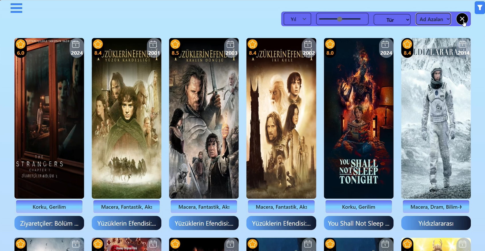
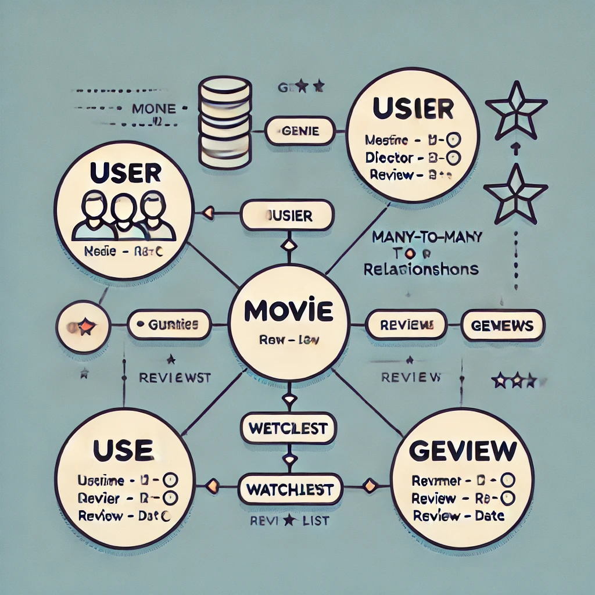

# Film 

### Preview:
[https://youtu.be/tAl1BnzjMUc](https://youtu.be/tAl1BnzjMUc)

<video align='center' src="https://youtu.be/tAl1BnzjMUc" height="100%" 
width="100%" controls></video>
</video>

### image

## Data Diagram:

## Tools Used:
- API
- React
- NodeJs
- Middleware
- MongoDB
- Tailwind CSS
- JavaScript

## Desgin used:
- HTML/CSS
- Bootstrap
- Prime Icons

###  Features: 
- User registration and login
- All User preview to all Films
- Registered Users watch List management
- All User search functionality to films
- All user filter functionality to films
- All user sort functionality to films
- All user delete functionality self reviews
- All user edit functionality self reviews

- Admin can add new film
- Admin can delete film
- Admin can update film
- Admin can delete all users reviews

## Database features:
- Genre:
    - Number id
    - String name

- Movie: 
    - String title
    - String original_title
    - String category
    - String director
    - Number release_date
    - Number duration
    - String language
    - String country
    - String plot
    - String poster_url
    - String video_url
    - Number rating
    - [CastSchema] cast
    - [CrewSchema] crew

- CastSchema: 
    - String name
    - String character
    - String profile_path

- CrewSchema: 
    - String name
    - String job
    - String profile_path

- Review:
    - ObjectId movie_id
    - ObjectId user
    - String comment
    - Number rating
    - Date review_date

- User:
    - String username
    - String email
    - String password
    - String role
    - [String] tokens

